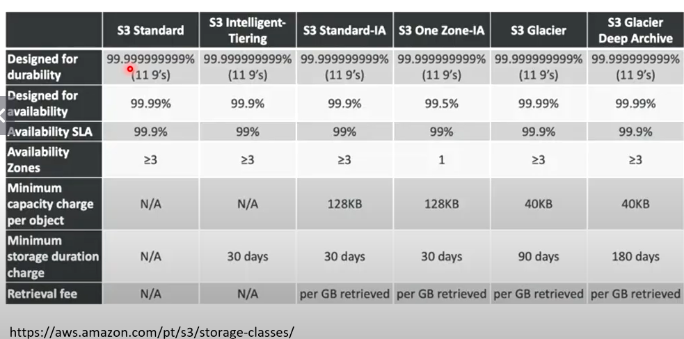

# ☁️ Desafio DIO - Gerenciando Instâncias EC2 na AWS

## 📖 Sobre o Projeto

Este repositório foi desenvolvido como parte do desafio prático da DIO com foco no gerenciamento de instâncias Amazon EC2 na AWS.

O objetivo foi consolidar conceitos fundamentais de computação em nuvem, segurança, armazenamento e gerenciamento de recursos, documentando os principais aprendizados obtidos durante o laboratório.

---

## 🎯 Objetivos de Aprendizagem

* Compreender o funcionamento do Amazon EC2
* Conhecer o modelo de responsabilidade compartilhada
* Entender escalabilidade vertical e horizontal
* Explorar serviços de armazenamento AWS
* Utilizar IAM para controle de acesso
* Documentar processos técnicos utilizando GitHub

---

## 🖼️ Evidências do Laboratório

### Arquitetura baseada em EC2 e Serverless

### Storage Classes

### AMI

.png)

### Como Interpretar o Nome de uma Instância EC2

.png)

### Tipos de Instâncias

.png)

### Famílias de Instâncias

.png)

### Lifecycle

.png)

---

## 🚀 Conceitos Estudados

### 🖥️ Amazon EC2

O Amazon EC2 (Elastic Compute Cloud) permite criar máquinas virtuais escaláveis na nuvem, possibilitando a execução de aplicações, serviços web e bancos de dados.

### 📦 AMI (Amazon Machine Image)

Uma AMI funciona como um modelo reutilizável contendo:

* Sistema operacional
* Configurações
* Aplicações
* Dependências

### 📈 Escalabilidade

#### Vertical (Scale Up)

Aumento dos recursos de uma única instância.

Exemplo:

* 2 vCPUs → 4 vCPUs
* 4 GB RAM → 16 GB RAM

#### Horizontal (Scale Out)

Adição de novas instâncias para distribuir a carga.

Exemplo:

* 1 servidor → 5 servidores

### 🔒 IAM

Boas práticas de segurança:

* Não utilizar a conta Root no dia a dia
* Habilitar MFA
* Utilizar grupos para gerenciamento de permissões
* Aplicar o princípio do menor privilégio

### 💾 Amazon EBS

Armazenamento em blocos utilizado por instâncias EC2.

Casos de uso:

* Bancos de dados
* Logs
* Sistemas de arquivos
* Aplicações web

### 🗄️ Amazon S3

Armazenamento de objetos para:

* Backups
* Imagens
* Vídeos
* Arquivos corporativos

### 🧊 Glacier e Deep Archive

Classes de armazenamento voltadas para arquivamento de longo prazo com menor custo.

### 💰 Billing e Controle de Custos

Ferramentas utilizadas para:

* Monitoramento de gastos
* Criação de orçamentos
* Configuração de alertas financeiros

---

## 📚 Tecnologias e Serviços Utilizados

* AWS EC2
* AWS IAM
* Amazon S3
* Amazon EBS
* AWS Billing
* Git
* GitHub

---

## 📝 Conclusão

Este laboratório permitiu consolidar conhecimentos essenciais sobre infraestrutura em nuvem utilizando a AWS, com foco na criação, gerenciamento e boas práticas relacionadas às instâncias EC2.

A experiência contribuiu para o desenvolvimento de habilidades práticas em Cloud Computing e documentação técnica.

## 👩‍💻 Autora

Thais Farias

Em transição para a área de Cloud Computing, desenvolvendo conhecimentos em AWS, infraestrutura e serviços em nuvem.
